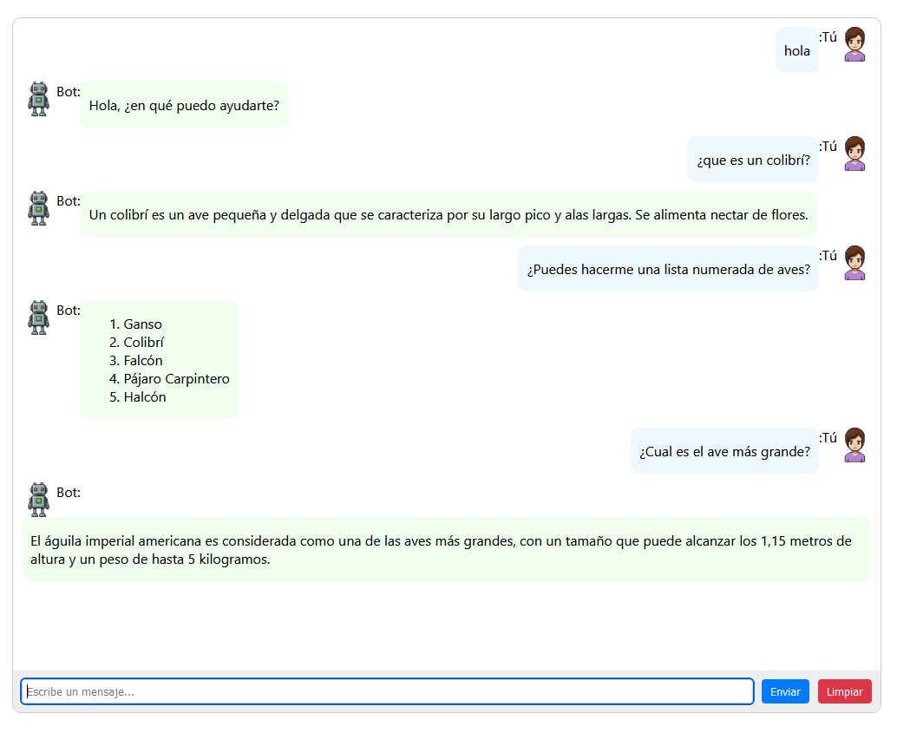

# Chat web usando llama3.1

- API en C#
- Web en Angular

## Correr Ollama con Docker

docker run -d --gpus=all -v ollama:/root/.ollama -p 11434:11434 --name ollama ollama/ollama

## Descargar el modelo llama3.1

docker exec -it ollama pull llama3.1

## Ejecutar la API

cd api
dotnet run

## Ejecutar el cliente WEB

cd chat
npm start

En el navegador ir a: http://localhost:4200

## Detener Ollama

docker stop ollama

## Volver a iniciar Ollama

docker start ollama